# Worksheet Two - Brainhurt OS

## Task One - 0xCAFEBABE

To build this task i followed chapter 2 of the Little Book of OS development and the provided resources in the Worksheet Two Part One pdf.

### Overview

The goal of the task is to set up the smallest operating system possible that can write 0xCAFEBABE to the EAX register. To do this i set up the bootloaders and loader.s files. The main bulk of interesting code is found in the loader.s file, shown below. 

---

*Setting up the magic number*

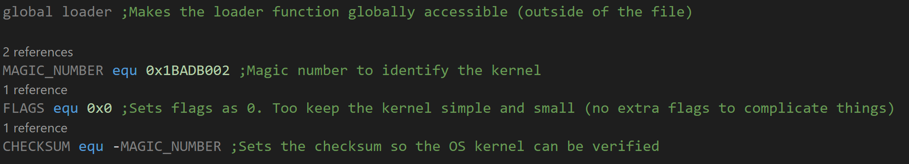

---

*Moving 0xCAFEBABE to EAX*

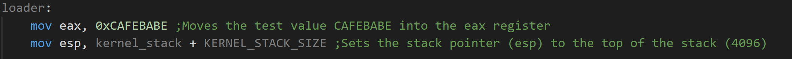

---

The above code is vital in the setup of the operating system. Below i have explained some of the above codes use. 

#### Code Explanation

- ```global loader``` makes the loader function accessible outside of the loader.s file. So other files can call it. 
- ```MAGIC_NUMBER equ 0x1BAD002``` equates the hex 0x1BAD002 to the variable MAGIC_NUMBER. This works similar to #define in c, so every time MAGIC_NUMBER is used it will be replaced with 0x1BAD002.
- ```loader:``` This is the start point on the loader function. Everyting inside this function is ran when loader is called. 
- ```mov eax, 0xCAFEBABE``` This moves (copies) the hex value 0xCAFEBABE to the eax register.

### Booting the OS

In order to run and test that the OS is bootable and successfully moving 0xCAFEBABE to the eax register we need to setup the makefile to assemble, link and build the OS. To do this we need to:
- Assemble the ```loader.s``` file using nasm.
- Link the ```loader.o``` to the emulator using the ```link.ld``` file.
- Generate an iso image using stage2_eltorito
- Run the QEMU emulator in curses mode with debug logQ.txt set. 

Below is an image of my makefile. Note this is the complete Makefile for the whole OS so i will identify the bits needed for task one.

---

*Makefile for booting OS*

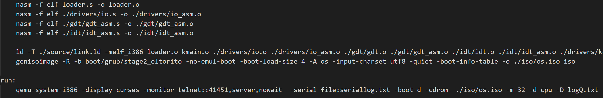

---

### Code Explaination 
- ```nasm -f elf loader.s -o loader.o``` This assembles the ```loader.s``` file into a ```loader.o``` object file
- ```ld -T ./source/link.ld -melf_i386 loader.o -o ./iso/boot/kernel.elf``` This links the ```loader.o``` object file into a ```kernel.elf``` binary using the ```link.ld``` script.

- ```genisoimage -R -b boot/grub/stage2_eltorito -no-emul-boot -boot-load-size 4 -A os -input-charset utf8 -quiet -boot-info-table -o ./iso/os.iso iso```.
This generates an iso image using the grub bootloader ```stage2_eltorito``` creating an ```os.iso``` image.

- ```qemu-system-i386 -display curses -monitor telnet::41451,server, -boot d -cdrom  ./iso/os.iso -m 32 -d cpu -D logQ.txt``` This runs the QEMU emulator and boots the OS, saving a log file ```logQ.txt```

### Testing and proof of 0xCAFEBABE

To test and prove that 0xCAFEBABE has been successfully moved into EAX, we simply have to run the OS and check within the logQ.txt that is generated. I used `crtl + f` to find all occurances of 0xCAFEBABE.

---

*Evidence of 0xCAFEBABE in logQ.txt*

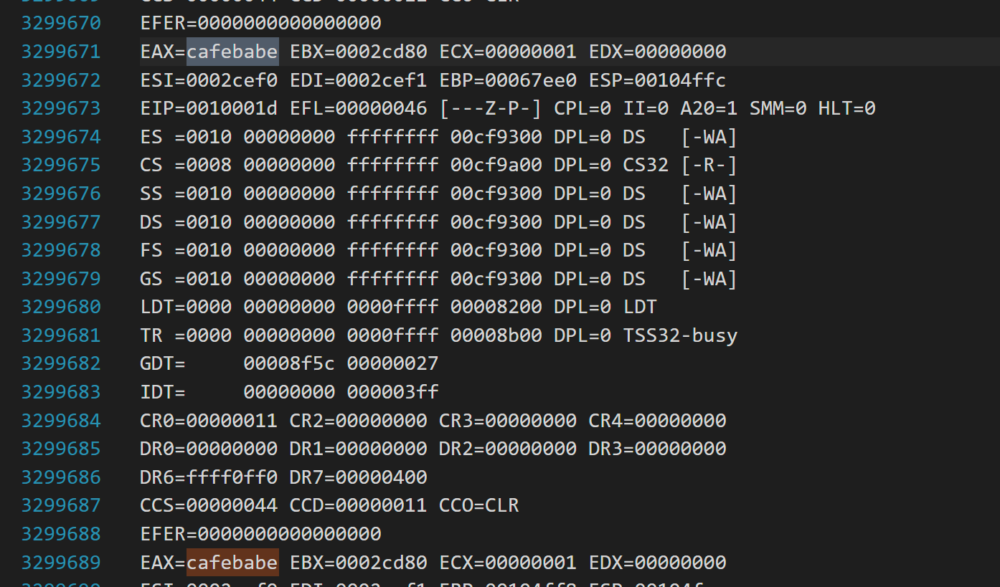

---

The above image shows evidence of CAFEBABE in the debug log of the OS. I can find 6 instances of CAFEBABE in the logs.

### Testing and proof of makefile that builds and runs the OS

To test that the makefile runs correctly i will present an image of the makefile commands below and show them working in the VIVO

---

*Make all example from makefile*

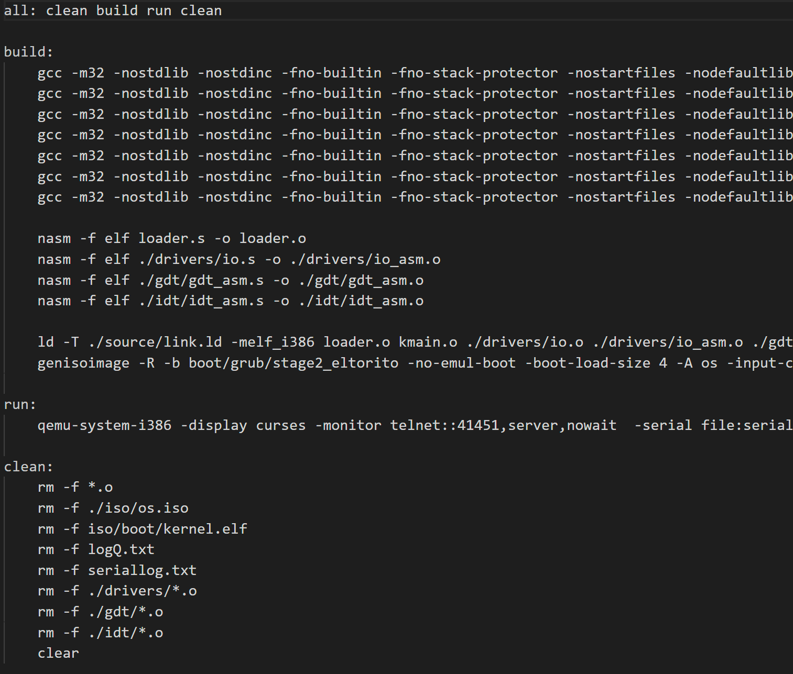

---

## Task Two - Chapter Three 

### Overview
Task Two instructs us to follow chapter three of the Little Book of OS Development implementing all the books features and at least two other C functions of our choosing. 

### Setting up a Stack
To get C programs working in our OS we need to set up the C stack. 
To do this we need modify the ```loader.s``` to reserve bytes to be used for the stack, then set the stack pointer the ```esp`` register to the end of the reserved memory. Below is the C code that does this.

---

*Reserving 4096 bytes for the stack*

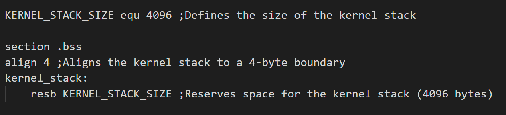

---

*Setting the stack pointer (esp)*

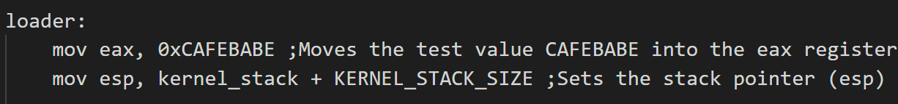

---

### Code Explaination

- ```align 4``` This makes sure that the assembler allocates a starting memory address for the next instructions that is a multiple of 4.

- ```resb KERNEL_STACK_SIZE``` This reserves 4096 bytes in memory that can be accessed and set later on.

- ```mov esp, kernel_stack + KERNEL_STACK_SIZE``` This sets the stack pointer to the end of the kernel stack reserved memory.

### Calling C programs from assembly

To call C programs from assembly we need to use the ```extern``` command. This allows the program to access functions from other files. Then to run the function the ```call``` command is used to execute it. If we want to pass arguments to the function we use the ```push``` command that pushes the given value onto the stack.

---
*Calling C functions from loader.s*


---

*The C functions from kmain.c*

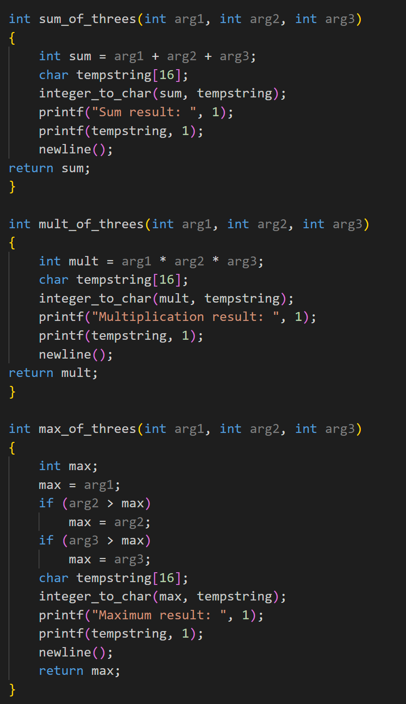

---

### Code Explaination

- ```extern sum_of_threes``` Tells the assembler that there is an external function called sum_of_threes.

- ```push dword 5``` Pushes the double word 5 onto the stack this will be arg1 in the sum_of_threes function.

- ```call sum_of_threes``` Calls the sum_of_threes function pushing the values on the stack towards the function. 

- ```integer_to_char``` This function that i setup for the shell. Im using it here to better display the program running. I will explain it later on.

### Testing the 3 C functions work
To test that the functions are correctly being called from the ```loader.s``` I have included a print function that will display the output.

#### Sum_of_threes
- Here i have set the input in ```loader.s``` to 5, 10 and 15.
- I am expecting 30 to be output.

#### Mult_of_threes
- Here i have set the input in ```loader.s``` to 2, 3 and 4.
- I am expecting 24 to be output.

#### Max_of_threes
- Here i have set the input in ```loader.s``` to 10, 25 and 15.
- I am expecting 25 to be output.

---
*Testing of C functions*

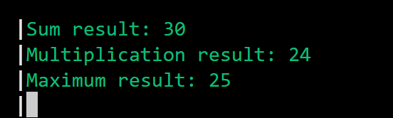

---

The above test shows that the functions are being called and operating as expected.

### Transfering Control to Kmain.c

To transfer control to the ```kmain.c``` program we simply need to call ```kmain.c``` from the ```loader.s``` 

---

*Transferring control to kmain*

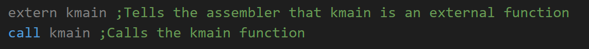

---

## Task Three - FrameBuffer

### Overview
Task Three asks us to follow chapter 4 in the Little Book of OS Development. Setting up the framebuffer and a simple api that allows characters to be written to the screen. Chapter 4 extends this by also implementing the serial port functionality, i have added both and allow the user to choose between them using printf("text", 0) for serial port or printf("text", 1) to use the memory mapped framebuffer.

### Setting up the framebuffer with memory mapping
The framebuffer is a hardware device (a section of RAM) that contains a bitmap that we can use to write data. It has 80 columns and 25 rows making up 2000 cells that can be used.
It has a starting address of 0x000B8000 with each cell being 16 bits. These 16 bits are used as following:
- Bits 0-3: Foreground Colour
- Bits 4-7: Background Colour
- Bits 8-15: for the 8 bit ASCII value

#### To write to the framebuffer we will:
- Create a pointer to the starting memory address of the framebuffer (0x000B8000)
- Set an ascii character to an index within the framebuffer. 
- Set the foreground and background nibbles to the next index using bitwise operations to arrange the binary correctly.

NOTE: The book and I have used a char pointer for the framebuffer and so byte offset is needed. The book does not include this for some unknown reason.

---

*Writing a char to the framebuffer*

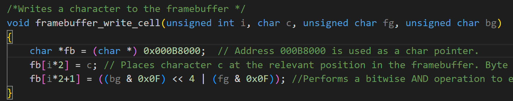

---

##### Code Explanation

- ```char *fb = (char *) 0x000B8000``` Creates a pointer `fb` to the memory address 0x000B8000. `(char *)` is a type cast that tells the compiler that 0x000B8000 is an address not an number.
- ```fb[i*2] = c``` This places a character into the memory address denoted by i*2. Since the framebuffer cells are 2 bytes each the ascii character is always placed in an even memory address space.
- ```fb[i*2+1]``` This places the fg and bg into the byte after the ascii character
- ```(bg & 0x0F) << 4``` This makes sure that only the lower 4 bits can set. Then performs a bit shift of 4 moving the lower 4 bits to the high bits. ie 0000 1111 -> 1111 0000.
- ```| (fg & 0x0F)``` This makes sure that only the lower 4 bits are set. Then adds the top 4 bits (bg) to the lower 4 bits (fg)

#### To move the cursor
To move the cursor we need to interract with the Framebuffers Command and Data ports. These are at the addresses ```0x3D4``` Command and ```0x3D5``` Data. To move the cursor we need to send the data port the new postion of the cursor but since the framebuffer is 2000 cells large an 8 bit number cannot be used as (2^8 = 256 < 2000) so we need to send over a 16 bit number since (2^16 = 65536 > 2000). However this causes an issue as the ```out``` command in x86-32 assembly only accepts 8 bit arguments so the position needs to be sent in two chunks. To solve this the Framebuffer Command port uses the command ```14``` and ```15``` to tell it whether it is expecting the high 8 bits or the low 8 bits of the position into the data port. 

---

*Function to move the cursor*

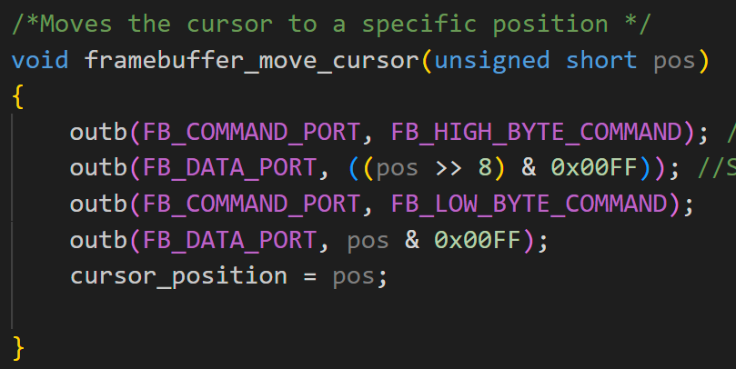

---

##### Code Explanation
- ```outb(FB_COMMAND_PORT, FB_HIGH_BYTE_COMMAND)``` Sends the command `15` to port `0x3D4` telling it to expect the high byte in the data port.
- ```(pos >> 8) & 0x00FF``` Performs a bitshift of 8 moving the top 8 bits of the short pos (16 bits) to the lower 8. Then performs bitwise AND with 0x00FF to make sure only the bottom 8 bits are set.

#### Wrapping out so its accessible in C
The `out` command we need to use to send the position to the framebuffer ports is an assembly command that C cannot access. To fix this we need to wrap the `out` function so C can use it. We do this by writing a .asm or .s file and declare a global function like `outb` or `inb` this allows C to call them. 

---

*Wrapping out function so C can use it*

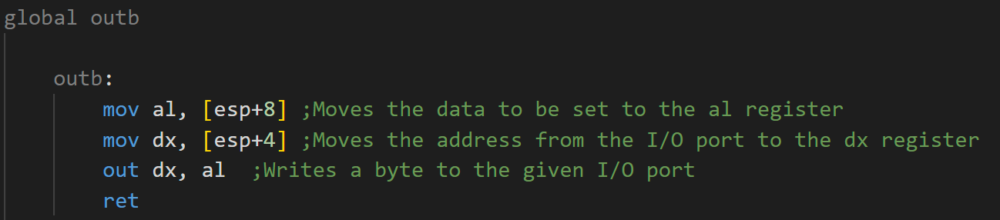

### Building framebuffer driver
The framebuffer driver needs to abstract all the complexities of writing characters to the framebuffer, advancing the cursor and moving to newlines. Providing the user with a simple commands to print characters and move to newlines. 


#### Printing Strings
Within the API i have built a ```fb_write_string``` function that can take a string input and output said string to the framebuffer. 
For example `fb_write_string("Testing")` to print the string "Testing" to the next cells in the framebuffer.
To do this we will need to pass a character pointer to our function, this will point to the first character in our string. The function will then loop around until it hits the null terminator (`'\0'`) as this is the end of the string. Within the loop we must check that the current cursor position is not at the start of a newline (`position % 80 == 0`) as this is reserved for a `|` character denoting each writable line of the framebuffer. This isnt strictally necessary but i think it looks better. Finally the program will write the character to the framebuffer using our ```framebuffer_write_cell``` function written earlier and advance the cursor by one.

---

*Printing string to the framebuffer*

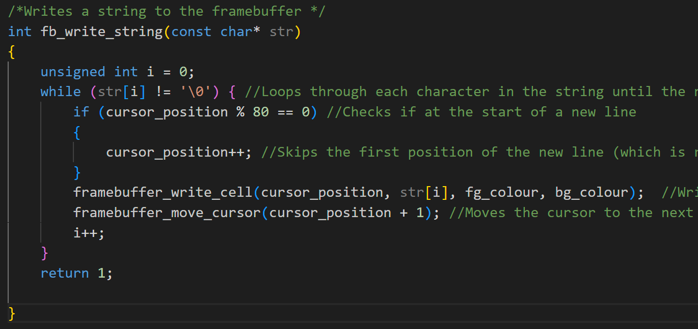

---

##### Code Explanation

- ```cursor_position % 80 == 0``` This checks if the current cursor position is at the start of a new row. ie; cells 0, 80, 160, 240...

- ```framebuffer_write_cell(cursor_position, str[i], fg_colour, bg_colour)``` This calls the write cell function and passes the arguments. The fg_colour and bg_colour are set by a different function: `set_text_colour`

#### Writing Newlines
In the current functionality of the OS the user can write strings to the framebuffer and move the cursor to specific cells, however keeping track of the specific cells to jump to when moving to a new line maybe tricky for the user. So i have abstracted this behind a `newline()` function that does it automatically when called. 
To do this we can use integer division in C, as all decimal values are truncated since we are working with integers and not floats. This allows us to find what row the cursor currently is in. For example: row 0 contains cells 0-79 any number between that range `/ 80` will return 0 decimal something but c ignores the decimal so we are left with 0.

---

*Newline function for the framebuffer*

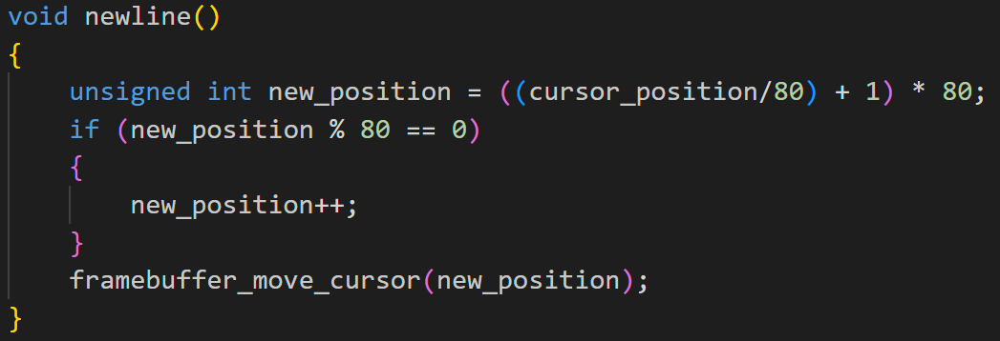

---

##### Code Explanation
- ```(cursor_position/80)``` Finds what row the cursor is currently at
- ```(cursor_position/80) + 1``` Finds the next row
- ```((cursor_position/80)+1)*80```Finds the starting cell number of the row
- ```if (new_position%60==0)```This simply makes sure to leave the first cell in each row free for a `|` character.

#### Clearing The Screen
Currently the framebuffer is full of garbage data that was dumped in during the booting of Brainhurt OS. This makes it very ugly and uses up some of the 2000 available cells. So i have extended the API to include a clear_screen() function.

This function simply loops through all 2000 framebuffer cells and sets them all to space 'blank' character except the first cell of each row that is reserved for a `|` denoting writable lines of the framebuffer.

---

*Clear Screen function for the framebuffer*

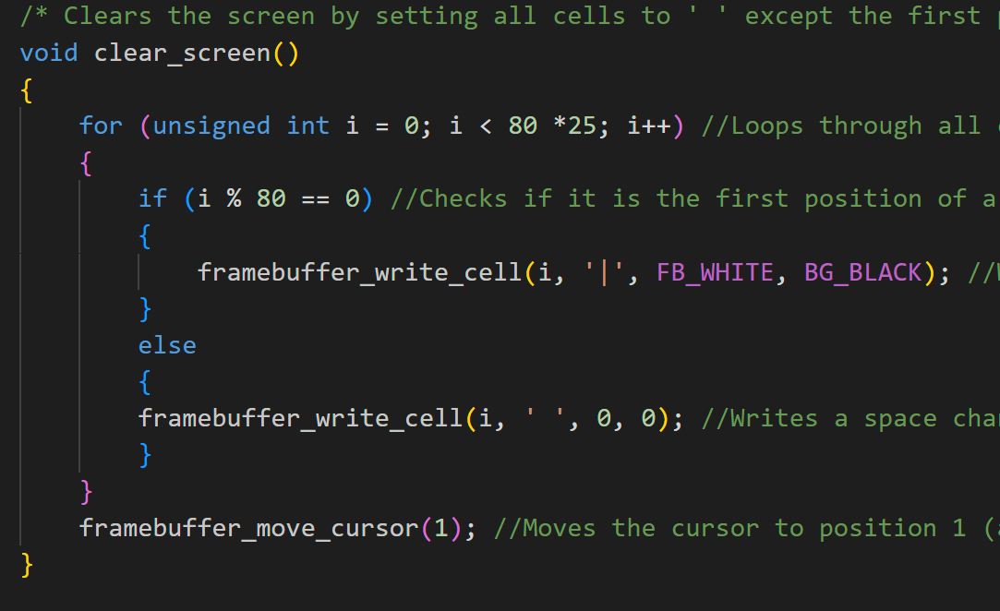

---

##### Code Explanation
- ```for (unsigned int i = 0; i < 80 * 25, i++)```This loops through all 2000 cells of the framebuffer (0-1999)

#### Testing Framebuffer Driver

---

*Kmain.c commands to test framebuffer functions*

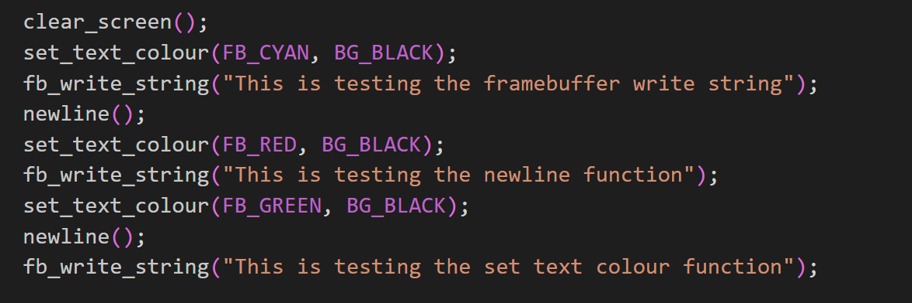

---

*Framebuffer output of the testing*


---

### Building the Serial Port Driver
There are other ways of writing and recieving data other than the framebuffer, for example the serial ports. The book uses the serial ports for error logging, but we wont be able to do this since the error logging is a utility of Bochs and we are using QEMU. I have set up the serial ports so the user can write text to `seriallog.txt` file.

#### Configuring the Serial Ports
Before we can use the serial port it must be configured. 


##### Baud Rate
 - First we must set the speed of the data being sent, this is called the baud rate it basically tells the devices communicating when exactly to check the data port for new data. 
- We need to do this because the serial ports use serial communication that is asynchronous this means that there is no clock pulse being sent alongside the data so the devices would have have no idea when to expect data being sent. 
- Both devices have their own clock, the serial port has a clock that runs at 115,200 bits per second this a standard speed so the device trying to communicate with it should know the speed of the clock.
- To configure the baud rate the communicating device sends the serial port a divisor. Which divides the 115,200 bits per second to the baud rate that is used for the duration of the communication.
- The divisor can be a 16 bit number (as some devices would need a very slow baud rate) but like the ```move cursor``` section the port can only recieve 8 bits a time, so we need to send the Serial Line Command port `0x3FB` the command `0x80` this sets the DLAB bit to 1. Which tells the serial port to expect a 16 bit communication with the high 8 bits being sent to the data port first and then the low 8 bits.

---

*Configuring Baud Rate*


###### Code explanation
- ```divisor >> 8``` Performs a bit shift right of 8 bits. Moves all of the bits from the high byte to the low byte.
- ```& 0x00FF``` Performs a bitwise AND to make sure only the the low byte has set data


##### Line Configuration
- The data is sent one bit at a time with a predefined frame size that tells the port how large each block of data being sent is: normally 8 bits (1 byte). 
- We will be sending ascii data, which is a 7 bits but we will be adding 1 bit to the end which is a stop bit. This tells the serial port that it has recieved all the bits in the current phase. 
- To set this up we need to send the Serial Line Command port `0x3FB` the command `0x03`.
-  The Line Command Port will look at the first two bits (bit 0 and 1) to know how many bits a character will have. There are four options either: 5 bits per character (0,0), 6 bits per character (0,1), 7 bits per character (1,0) or 8 bits per character (1,1)
- We are sending 7 bit ascii with one stop bit, so each character is 8 bits so we choose the final option: 8 bits per character (1,1) giving us the command `0x03` = 0000 0011 

---

*Configuring Line Rate*

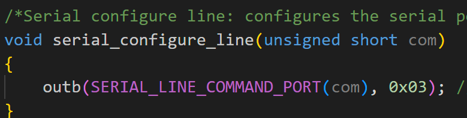

---

##### Configuring the Buffers
- When we send data to the serial ports that data is stored in a buffer. This is to hold data incase we send data faster than it can be transmitted. These buffers however will overflow if we send too much data at once, which will cause overflow errors and havoc. So we can set the buffers to FIFO queues that will send out data based on First in First out principles and to destroy any extra data that is recieved while the buffer is full. 
- To set this we must send the command ```0xC7``` = 11000111 to the FIFO command port `0x3FA`

---

*Configure FIFO buffer*

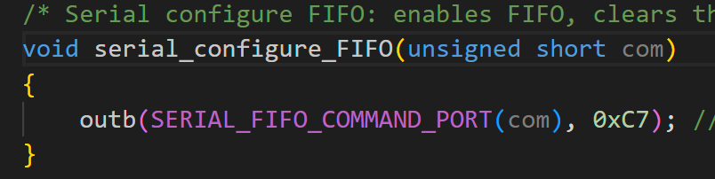

---

##### Configuring the Modem
- When we are transmitting data we only want to send data during the baud rate up pulse and when reciever is ready. We simply set this by setting the control bits for Ready to Transmit (RTT) and Data Terminal Ready (DTR) to 1.
- The command for this is `0x03` which we sent to the Modem Command Port `0x3FC`

---

*Configure the Modem*


---

Now that all of the serial port configuration is complete this can all be wrapped in a serial_init function to be called when we want to use the serial port.

#### Writing to the Serial Port
To write to the serial port we simply need to check if the RTT is set to 1. If it is not then we just wait a small amount of time and check again. 
We can write ascii characters simply by sending the data to the serial Data Port `0x3F8`

I have implemented the ability to write strings which is done simply by looping through the string until the null terminator is hit and writing each character. 

#### Testing the serial port
To test the serial port i will write a test string to the seriallog.txt file. 

---

*Testing code in kmain.c*

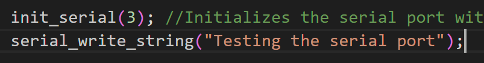

---

*The output from testing code*

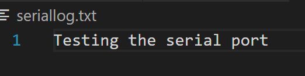

---

### Bringing together the Framebuffer and Serial Port
Now both the serial port and framebuffer have been created and have working apis i will put them together into a printf function that will allow the user to write to either the framebuffer or serial port or both.
I will use the format: printf("text", option) 
- Option 0: Serial port
- Option 1: Framebuffer
- Option 2: Both 

---

*Printf function*

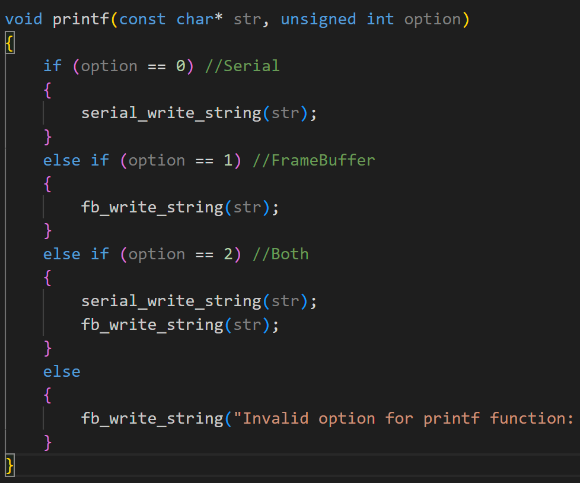

---

### Testing Task 3

---

*Testing code*

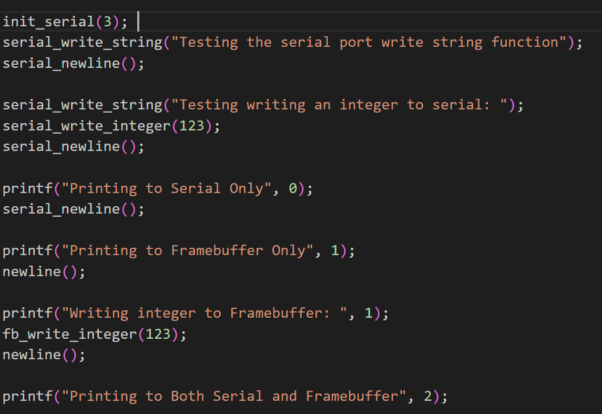

---

*Test result: Serial*

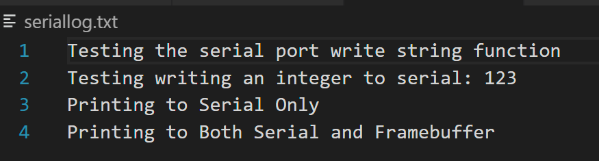

---

*Test result: Framebuffer*

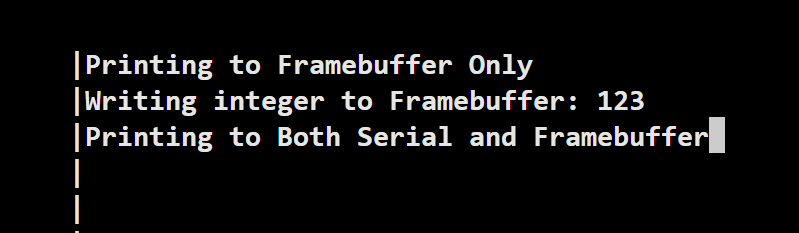

---

To test the coordinate based set_cursor_position i added to the testing code: ```set_cursor_position(79,24);``` Which should move the cursor to the bottom right of the frame buffer.

---

*Test Result: Move cursor with coordinates*

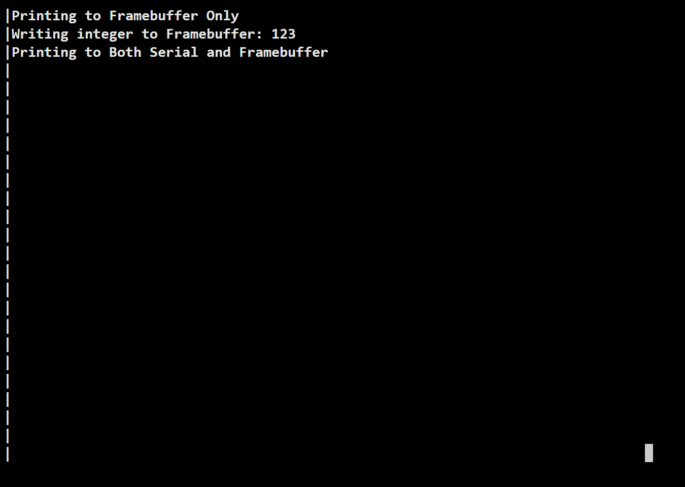

---

# Worksheet Two Part Two - Brainhurt OS

